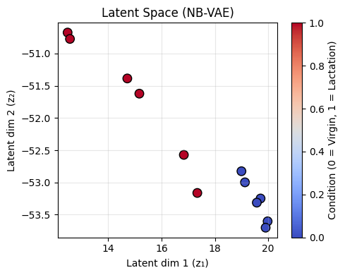
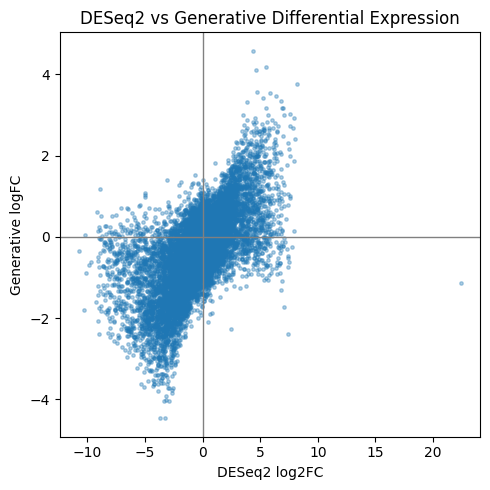
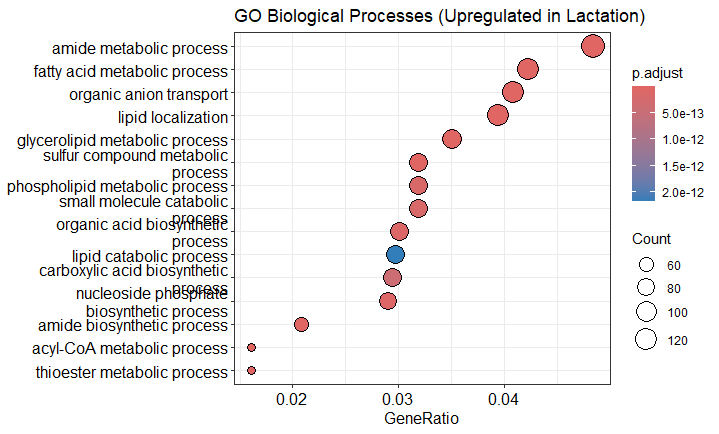
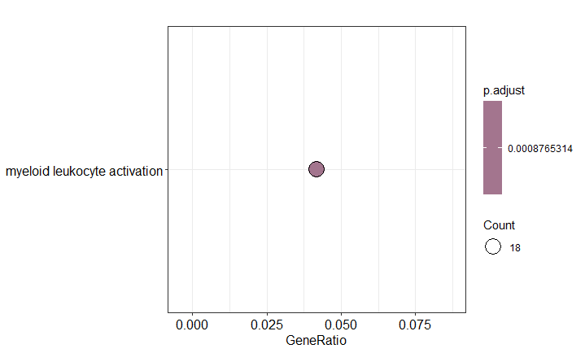

# 🧬 Generative Differential Expression Analysis of Bulk RNA-seq Data

[](LICENSE)

This project explores whether **deep generative models** can learn biologically meaningful signals from **bulk RNA-seq count data**, and how their differential expression estimates compare with the classical **DESeq2** framework.

Rather than optimizing predictive accuracy, the goal is to **study representation learning, uncertainty, and biological interpretability** using a Negative Binomial Variational Autoencoder (NB-VAE).

---

## 📍 Motivation

Classical differential expression methods such as **DESeq2** rely on gene-wise statistical testing under a Negative Binomial model and have been highly successful in RNA-seq analysis. However, they exhibit known limitations:

- Genes with extremely sparse or unstable counts often yield **NA p-values**
- Each gene is tested independently, ignoring global structure across samples
- Uncertainty is quantified at the gene level, not at the representation level

This project asks a simple but fundamental question:

> **Can a generative deep learning model learn biologically meaningful structure from raw count data, and provide complementary differential expression insights?**

---

## 🧪 Dataset

- **Source**: GEO — GSE60450  
- **Organism**: Mouse (*Mus musculus*)
- **Conditions**: Lactation vs Virgin mammary gland
- **Samples**: 12 (6 per condition)
- **Genes**:
  - Raw: 27,129 genes
  - After filtering (≥10 total counts): 18,418 genes

---

## 🛠️ Methodology Overview

1. **Data preprocessing** and metadata creation (Notebook 1)
2. **Differential expression using DESeq2** (R / Bioconductor)
3. **Negative Binomial Variational Autoencoder (NB-VAE)** trained on raw counts
4. **Generative differential expression** via decoded mean expression
5. **Pathway enrichment comparison** between DESeq2 and the generative model

---

## 🧠 Model Summary

- **Architecture**: Negative Binomial Variational Autoencoder
- **Latent dimension**: 2
- **Likelihood**: Negative Binomial
- **Offsets**: DESeq2 size factors (fixed, not learned)
- **Training objective**: Evidence Lower Bound (ELBO)

The model learns a **low-dimensional latent representation of samples**, from which gene-wise mean expression is reconstructed.

---

## 📊 Results Summary

### 🔹 Unsupervised Latent Space Learning

The 2D latent space learned by the NB-VAE shows a **clear separation between lactation and virgin samples**, despite the model being trained without condition labels.



---

### 🔹 Agreement with DESeq2

Generative log fold-changes derived from the model show strong agreement with DESeq2 estimates.

- **Pearson correlation** ≈ **0.66**
- Expected shrinkage of extreme DESeq2 logFC values
- Increased stability for low-count genes



---

### 🔹 NA Genes in DESeq2

Several genes assigned **NA adjusted p-values** by DESeq2 due to sparse counts receive **finite and directional logFC estimates** from the generative model, highlighting its ability to provide uncertainty-aware estimates beyond classical testing.

---

## 🧬 Pathway Enrichment Analysis

To compare biological signals at the pathway level, Gene Ontology (GO) & KEGG Biological Process enrichment was performed for both approaches.

### GO Enrichment – DESeq2



### GO Enrichment – Generative Model



While DESeq2 highlights canonical lactation-associated metabolic pathways, the generative model yields a **more conservative but distinct set of immune-related and regulatory pathways**, reflecting its shrinkage-based inference and uncertainty modeling.

---

## 🚧 Limitations

- Small sample size (n = 12)
- Fixed dispersion parameter in the NB likelihood
- Generative pathway enrichment is conservative and sensitive to ranking thresholds
- The model is intended for **exploration**, not production deployment

---

## 🔮 Future Directions

- Learn gene-wise dispersion parameters
- Extend to larger RNA-seq cohorts
- Compare with scVI / ZINB-based models
- Integrate batch-effect modelling explicitly

---

## 📁 Repository Structure

```
.
├── notebooks/
│ ├── 01_data_loading_and_metadata.ipynb
│ └── 02_generative_differential_expression.ipynb
│
├── r_scripts/
│ └── deseq2_and_pathway_analysis.R
│
├── data/
│ ├── counts_matrix.tsv
│ ├── metadata.tsv
│ └── size_factors.tsv
│
├── results/
│ └── figures/
│ ├── latent_space.png
│ ├── logfc_scatter.png
│ ├── go_deseq2.png
│ ├── go_generative.png
│ ├── kegg_deseq2.png
│ └── kegg_generative.png
|
├── requirements.txt
├── LICENSE
└── README.md
```

---

## 🙏 Acknowledgements

This project was conducted as a **learning-driven experiment** to understand how deep generative models can capture biological structure in transcriptomic data.

Feedback, critique, and discussion are warmly welcome.

Thank you!!

